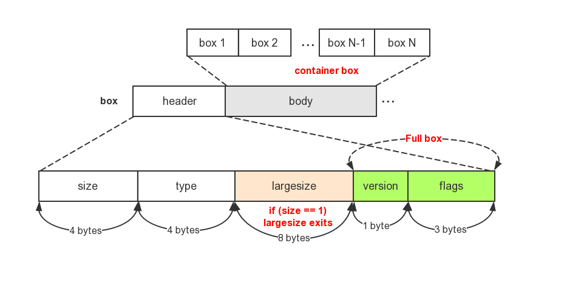
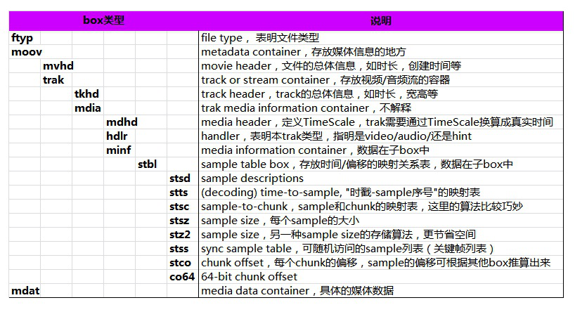

* [关键概念](#关键概念)
   * [文件结构](#文件结构)
   * [box](#box)
      * [box详解](#box详解)
# 关键概念
MP4 文件格式中，所有的内容存在一个称为 movie 的容器中。一个 movie 可以由多个
tracks 组成。每个 track 就是一个随时间变化的媒体序列，例如，视频帧序列。track 里的每个时
间单位是一个 sample，它可以是一帧视频，或者音频。sample 按照时间顺序排列。注意，一帧
音频可以分解成多个音频 sample，所以音频一般用 sample 作为单位，而不用帧。MP4 文件格式
的定义里面，用 sample 这个单词表示一个时间帧或者数据单元。每个 track 会有一个或者多个
sample descriptions。track 里面的每个 sample 通过引用关联到一个 sample description。这
个 sample descriptions 定义了怎样解码这个 sample，例如使用的压缩算法。
与其他的多媒体文件格式不同的是，MP4 文件格式经常使用几个不同的概念，理解其不同
是理解这个文件格式的关键。
这个文件的物理格式没有限定媒体本身的格式。例如，许多文件格式将媒体数据分成帧，
头部或者其他数据紧紧跟随每一帧视频，！！！TODO（例如 MPEG2）。而 MP4 文件格式不是如
此。
文件的物理格式和媒体数据的排列都不受媒体的时间顺序的限制。视频帧不需要在文件按
时间顺序排列。这就意味着如果文件中真的存在这样的一些帧，那么就有一些文件结构来描述媒体
的排列和对应的时间信息。
MP4 文件中所有的数据都封装在一些 box 中（以前叫 atom）。所有的 metadata(媒体描
述元数据)，包括定义媒体的排列和时间信息的数据都包含在这样的一些结构 box 中。MP4 文件格
式定义了这些这些 box 的格式。Metadata 对媒体数据（例如，视频帧）引用说明。媒体数据可以
包含在同一个的一个或多个 box 里，也可以在其他文件中，metadata 允许使用 URLs 来引用其他
的文件，而媒体数据在这些引用文件中的排列关系全部在第一个主文件中的 metadata 描述。其他
的文件不一定是 MP4 文件格式，例如，可能就没有一个 box。
有很多种类的 track，其中有三个最重要，video track 包含了视频 sample；audio track
包含了 audio sample；hint track 稍有不同，它描述了一个流媒体服务器如何把文件中的媒体数据
组成符合流媒体协议的数据包。 如果文件只是本地播放，可以忽略 hint track，他们只与流媒体有
关系。
# 文件结构


# box

- box由header和body组成，其中header指明box的size和type。size是包含box header的整个box的大小。
- box type，通常是4个ASCII码的字符如“ftyp”、“moov”等，这些box type都是已经预定义好的，表示固定的含义。如果是“uuid”，表示该box为用户自定义扩展类型，如果box type是未定义的，应该将其忽略。
- 如果header中的size为1，则表示box长度需要更多的bits位来描述，在后面会有一个64bits位的largesize用来描述box的长度。如果size为0，表示该box为文件的最后一个box，文件结尾（同样只存在于“mdat”类型的box中）。
- box中可以包含box，这种box称为container box。
- box分为两种，Box和Fullbox。FullBox 是 Box 的扩展，Header 中增加了version 和 flags字段，分别定义如下：
```
aligned(8) class Box (unsigned int(32) boxtype,
    optional unsigned int(8)[16] extended_type) {
    unsigned int(32) size;
    unsigned int(32) type = boxtype;
    if (size==1) {
        unsigned int(64) largesize;
    } else if (size==0) {
    // box extends to end of file
    }
    if (boxtype==‘uuid’) {
        unsigned int(8)[16] usertype = extended_type;
    }
}
```
## box详解


## ftyp
```
aligned(8) class FileTypeBox extends Box(‘ftyp’) 
{ 
    unsigned int(32) major_brand; 
    unsigned int(32) minor_version; 
    unsigned int(32) compatible_brands[];  // to end of the box 
}
```
### brands
> Each brand is a printable four-character code, registered with ISO, that identifies a precise specification. //在ISO注册的4个字符。

   | Brand	|Extension|Mime Type 
---|---|---|---


MP4	|mp41, mp42|	.mp4	|video/mp4, audio/mp4, application/mp4
3GPP	|various, e.g. 3gp4, 3gp5|	.3gp	|video/3gpp, audio/3gpp
3GPP2	|3g2a	|.3g2	|video/3gpp2, audio/3gpp2
Motion JPEG 2000|	mjp2	|.mj2	|video/mj2
QuickTime	|"qt"|	.mov	|video/quicktime
