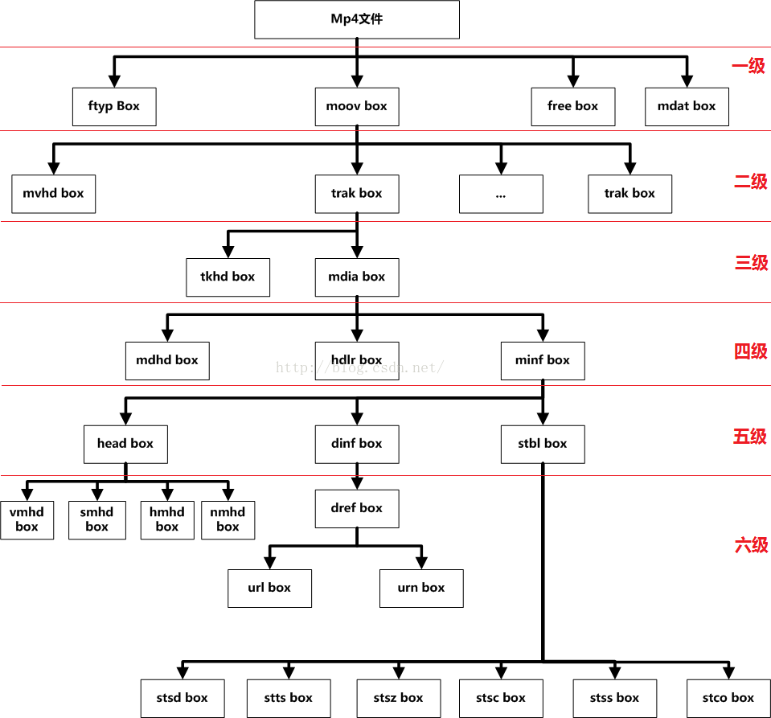

# 文件结构


# box

- box由header和body组成，其中header指明box的size和type。size是包含box header的整个box的大小。
- box type，通常是4个ASCII码的字符如“ftyp”、“moov”等，这些box type都是已经预定义好的，表示固定的含义。如果是“uuid”，表示该box为用户自定义扩展类型，如果box type是未定义的，应该将其忽略。
- 如果header中的size为1，则表示box长度需要更多的bits位来描述，在后面会有一个64bits位的largesize用来描述box的长度。如果size为0，表示该box为文件的最后一个box，文件结尾（同样只存在于“mdat”类型的box中）。
- box中可以包含box，这种box称为container box。
- box分为两种，Box和Fullbox。FullBox 是 Box 的扩展，Header 中增加了version 和 flags字段，分别定义如下：
```
aligned(8) class Box (unsigned int(32) boxtype,
    optional unsigned int(8)[16] extended_type) {
    unsigned int(32) size;
    unsigned int(32) type = boxtype;
    if (size==1) {
        unsigned int(64) largesize;
    } else if (size==0) {
    // box extends to end of file
    }
    if (boxtype==‘uuid’) {
        unsigned int(8)[16] usertype = extended_type;
    }
}
```

